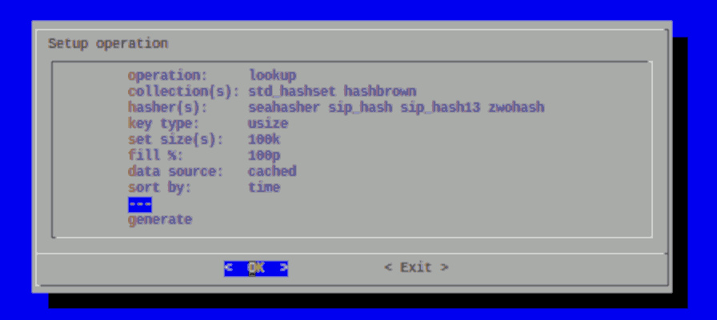
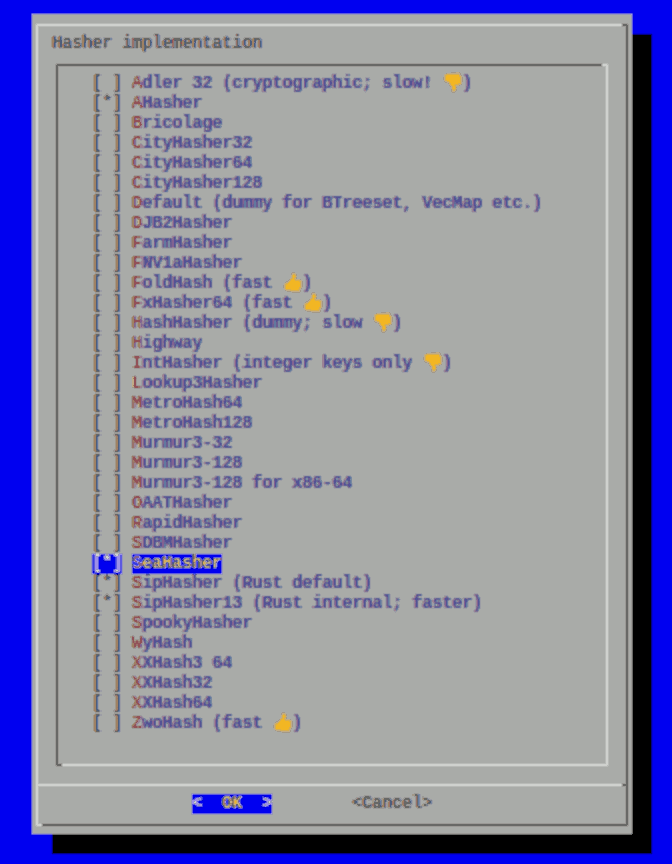

# hasherbench

A Rust command line tool to benchmark and compare speed of many hashing algorithms and some HashSet-like collection types for multiple key type and access operations.

Only Rust-native hashers are used, no wrappers for C/C++ implementations. Focuses on high-performance, not cryptographically secure hashing. Offers various permutation and output parameters.

## Approaches

This crate consists, historically grown, of two totally different implementation approaches:

1. a `cargo bench` based collection of hardcoded benchmark permutation functions (**unsupported**)
2. a command line based tool with many operation parameters

# Command line tool approach (dynamic + efficient)

- ordinary command line tool written in Rust.
- 9 parameters for permutations definition (collection, hasher, offset, key type, string key length, operation, hit rate percent, set size, key step), all dynamically specifyable and optimized tio avoid redundancy.
- supports single- and multi-threaded execution

## Features

- Multiple hashing algorithms, Rust-native implementations only. Currently included:
  - [`Adler32`]
  - [`AHasher`]
  - [`Bricolage`]
  - [`CityHasher32`]
  - [`CityHasher64`]
  - [`CityHasher128`]
  - [`DJB2Hasher`]
  - [`FarmHasher`]
  - [`FNV1aHasher32`]
  - [`FNV1aHasher64`][]
  - [`FoldHash` (fast)][foldhash::fast::FoldHasher]
  - [`FoldHash` (quality)][foldhash::quality::FoldHasher]
  - [`FxHasher32`]
  - [`FxHasher64`]
  - [`HashHasher`]
  - [`HighwayHasher`]
  - [`IntHasher`]
  - [`Lookup3Hasher`]
  - [`MetroHash64`]
  - [`MetroHash128`]
  - [`Murmur3Hasher`]
  - [`Murmur3Hasher128`]
  - [`Murmur3Hasher128x64`]
  - [`OAATHasher`]
  - [`RapidHasher`]
  - [`SDBMHasher`]
  - [`SeaHasher`]
  - [`SipHasher`]
  - [`SipHasher13`]
  - [`SpookyHasher`]
  - [`WyHash`][wyhash::WyHash]
  - [`WyHash3` final][wyhash::final3::WyHash]
  - [`XxHash3_64`]
  - [`XxHash32`]
  - [`XxHash64`]
  - [`ZwoHasher`]
- Multiple collection types to apply. Not all use hashing algorithms, yet may perform better in some use cases:
  - [`StdLib` `HashSet`][std::collections::HashSet]
  - [Hashbrown `HashSet`][hashbrown::HashSet] - Rust port of Google's *`SwissTable`*
  - [`BTreeSet`] (no hashing),
  - [`LiteMap`] (no hashing),
  - [`VectorMap`][vector_map::VecMap] (no hashing),
  - [`VecSet`][vecmap::VecSet] (no hashing),
  - Dummy (no collection, just hashing)
- Benchmarking sets filled with any number of items between 1 and 1 million
- Custom key offsets and steps, to spread key ranges (like eg, 3010, 3017, 3024, 3031, 3038 etc. with `--offset=3010
  --step=7`
- Key types `u32`, `u64`, `u128` or `String`
- String keys with lengths between 4 and 10,000 random (printable Ascii) characters each
- Measuring setup or lookup operations in (Hash)Sets
- Measurement of (Hash)Set lookup hits and misses of arbitrary percentages
- Using either [`Instant`] or [`SystemTime`] as timing source; see [`TimerSourceEnum`] for rationale
- Output formats
  - plain text
  - CSV
  - JSON
- Human-readable or compact output formats
- Customizable warmup amd execution time per permutation; to balance precision vs. execution duration
- Either single- or multi-threaded execution of benchmarks

## Usage

Build ordinarily by **`cargo build`**. Invoke without arguments to see all options. Invoke **`hasherbench --help`** for more verbose help.

```Benchmark several kinds of Hashers, key types and HashSets
Usage: hasherbench [OPTIONS] <--coll <COLLECTION>...|--hasher <HASHER>...|--offset <OFFSET>...|--keytype <KEYTYPE>...|--length <LENGTH>...|--op <OP>...|--percent <HIT_RATE>...|--size <SIZE>...|--step <STEP>...>

Options:
  -h, --help     Print help (see more with '--help')
  -V, --version  Print version

Permutation parameters:
  -c, --coll <COLLECTION>...   Type(s) of collections to benchmark [default: std] [possible values: none, std, hashbrown, btreeset, litemap, vecmap, vectormap, all]
  -H, --hasher <HASHER>...     Hash algorithms to benchmark [default: sip,sip13,adler32,fx64] [possible values: adler32, ahasher, bricolage, city32, city64, city128, djb2, farm, fnv1a32, fnv1a64, foldhashfast, foldhashqual, fx32, fx64, hashhasher, highway, inthasher, lookup3, metro64, metro128, murmur32, murmur128, murmur128x64, oaat, rapid, sdbm, sea, sip, sip13, spooky, wy1, wy3, xx364, xx32, xx64, zwo, all]
      --offset <OFFSET>...     First index number to use for generated keys [default: 1]
  -K, --keytype <KEYTYPE>...   Key types [default: u32,u64,u128,S] [possible values: u32, u64, u128, string, all]
  -l, --length <LENGTH>...     Length(s) for string key type. Valid range: `4...10_000` [default: 8,32]
      --op <OP>...             Operation(s) to perform [default: lookup] [possible values: setup, lookup]
      --percent <HIT_RATE>...  Percentage of key hit rate, i.e. how many lookups will find something [default: 100]
  -s, --size <SIZE>...         Number of elements to lookup in hashset. Valid range: `1...1_000_000` [default: 100,1000,10000]
      --step <STEP>...         Value to add to key to generate next one. Valid range: `1...1_000_000` [default: 1] [aliases: --add]

General operation parameters:
  -D, --maxms <RUN_MS>         Maximum duration in milliseconds for each benchmark to run [default: 1000]
  -P, --threads <THREADS>      Parallelism, number of threads to use for execution [default: 1] [aliases: --parallelism]
  -t, --tolerance <TOLERANCE>  Maximum timing tolerance in percent; iteration durations with greater distance to average will be dropped [default: 15]
  -T, --timer <TIMER>          Facility to use for measuring timing [default: instant] [possible values: instant, systime]
  -W, --warmup <WARMUP_MS>     Warmup duration in milliseconds for each benchmark (0 = disable) [default: 100]
  -Y, --yes                    Assume "yes" on all questions

Output options:
      --output-mode <OUTPUT_MODE>  Output mode for result data: compact or human-readably formatted (see `--human-readable` for progress output) [default: formatted] [possible values: compact, formatted]
  -F, --format <FORMAT>...         Output data format to use [default: txt] [possible values: txt, csv, json]
      --human-readable             Format stdout emission of live permutation result in expanded, human-friendlier (instead of compact) form. See `--output-mode` for formatting of result data [aliases: --hr]
      --csv-header                 Whether a header line with field names should be emitted on CSV output
  -o, --file <OUTPUT_FILE>         Output file to store results at; defaults to stdout
  -O, --overwrite                  Overwrite existing output file if it exists (also implied by -y)
  -q, --quiet                      Suppress all text output apart from results in selected format(s) to stdout; abort on error or questions (unless -y). Alias for "-v quiet"
  -R, --reverse                    Reverse sort order of output
  -S, --sort <SORT>...             Sort results in output [default: time] [possible values: none, index, iterations, time, timemin, timemax, collection, hasher, keytype, size, length, offset, step, op, hitrate]
  -v, --verbose <VERBOSITY>        Verbosity (0 = quiet) [default: p] [possible values: quiet, err, warn, info, progress, ops, values]
```

Try executing **`hasherbench -F JSON -K u64`** for a start. Then experiment with various parameters.

## Implementation

Struct [`Main`] contains most of business logic and global program state.

### Adding new (or removing) hashers or collection types

Only hashers that implement [`Hash`] trait and provide [`BuildHasher`] are supported. In ***Rust***, this is a
trivial requirement.

1. add hasher or collection crate to `Cargo.toml`
1. add variant to [`HasherEnum`] or [`CollectionType`]
1. add variant to `impl Display for HasherEnum` or `impl Display for CollectionType`
1. add variant to [`HasherEnum::expand()`] or [`CollectionType::expand()`]
1. add variant to [`Main::create_collection()`].<br> Easiest if hasher implements [`BuildHasherDefault`]. If it does
   not, another expression to create its [`BuildHasher`] must be given. Like for *`FoldHasher`*s.
1. for collection: regard [`CollectionType::does_not_use_hasher()`]

# `cargo bench` (**unsupported!**)

- was intended to obey KISS principle
- bases on `cargo bench` command and uses [Criterion](https://bheisler.github.io/criterion.rs/criterion/index.html) benchmark harness. Just execute **`cargo bench`** to start it.
- static, simple, very(!) longsome in both compiling and executing
- creates fixed set of ca. 8000 permutations to execute. Unoptimized, i.e. some redundant permutations may be executed repeatedly. Not configurable without source code modification. Although minimum timing values supported by Criterion are used, each permutation takes between 2...3  seconds.
- results are stored in many thousands files and directories created by Criterion.
- two shell-scripts (`refine_results.sh` and `evaluate.sh`) are provided to deal with results.
- code exclusively in **`benches/`** subdirectory. Many, mostly very small Rust source code files.
- makes massive use of Rust macro expansion and generics. Hence, quite little source code results in enormous compilation times.
- this approach is **unsupported**! Left only for demonstration purposes **how not to do this**! I.e. when `cargo bench` is not right solution.

The amount of result data created by `Criterion` is hardly of any use for direct evaluation and not easy to retrieve manually. Hence, two **shell scripts** are provided to help make some use of results:

1. `refine_results.sh`:
   - requires:
     - **`jq`** - command line JSON processor
     - **`GNU Awk`** - simple text processing language
   - simple script to condense each Criterion result of a benchmark permutation into one line and value
   - must be run in project directory (not inside `target/` direrctory or elsewhere!) after `cargo bench` is finished (or aborted).
   - creates file **`results.txt`**. Contents look like (arbitrary excerpt):

     ```
     lookup_100000_100p_string1024_std_hashset_xxhash64            69010.431 micros/run;     690 nanos/iter
     lookup_100000_100p_string1024_std_hashset_zwohasher           65088.320 micros/run;     650 nanos/iter
     lookup_100000_100p_string128_btreeset_default_hasher          60928.266 micros/run;     609 nanos/iter
     lookup_100000_100p_string128_hashbrown_adler32              1316432.526 micros/run;   13164 nanos/iter
     lookup_100000_100p_string128_hashbrown_ahasher                14737.974 micros/run;     147 nanos/iter
     ```

2. `evaluate.sh`:
   - requires:
     - **`BASH`** - GNU Bourne-Again SHell
     - **`GNU Awk`** - simple text processing language
     - **`GNU grep`** - data searching tool
     - **`dialog`** - offers various NCurses-based dialog types for text console
   - script to present selections, meaningful to manual comparison, from `results.txt` file. **Pre-generated** by script `refine_results.sh`. This script does neither run `cargo bench` nor creates `results.txt` from previous run itself.
   - saves state between individual runs in `evaluate.state`.
   - screenshots:
     
     
